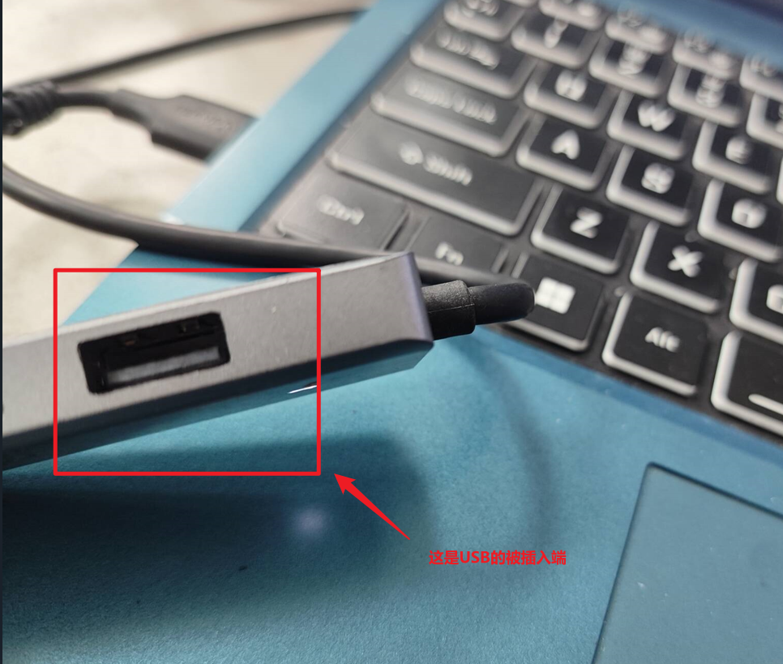
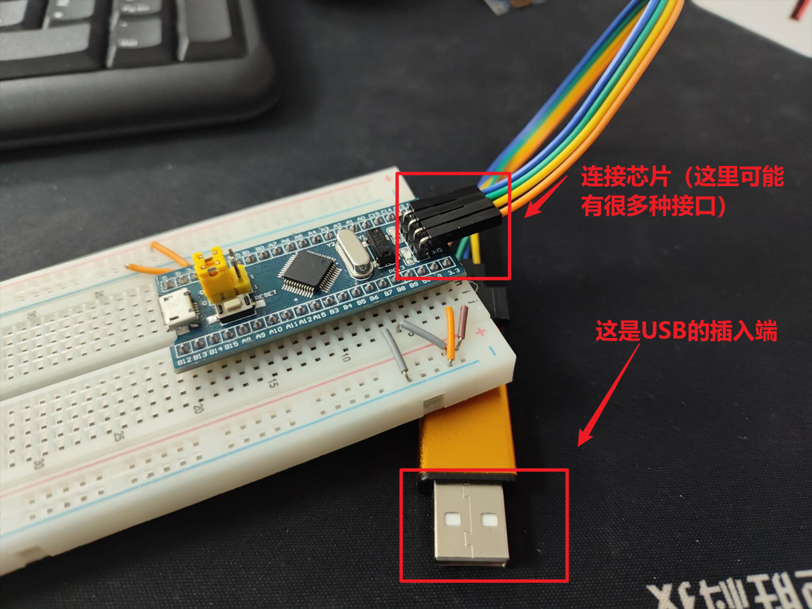
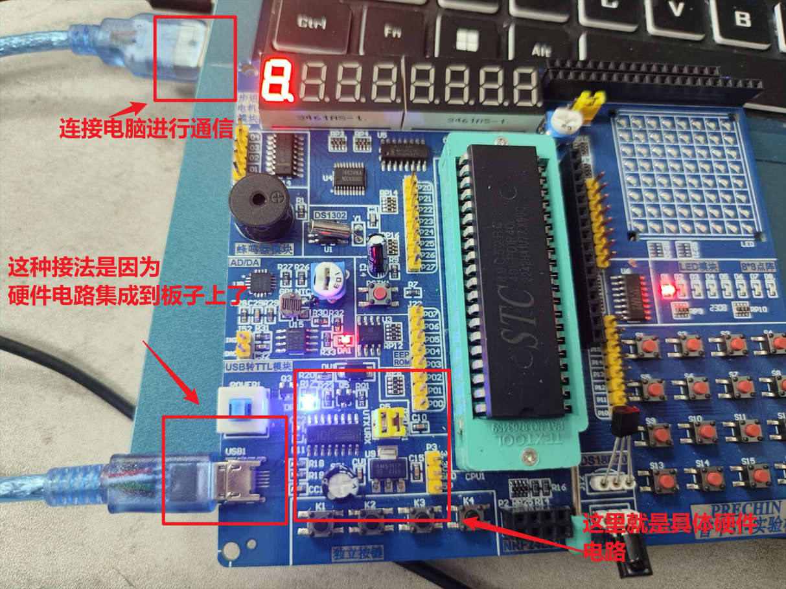

# CH341SER介绍（了解即可）

### 1.CH341SER是什么

CH341SER是一种**驱动软件**，通过驱动USB接口向外部发送串口（不知道什么是串口也没关系，理解为一种数据格式即可）数据，驱动软件是一种**控制硬件工作**的软件。可以向硬件发送指令或者操作硬件。驱动软件服务于上层的软件，普通软件通过被驱动软件服务才能完成特定的操作

| 软件类型 | 例子           | 功能                       |
| -------- | -------------- | -------------------------- |
| 普通软件 | 抖音           | 播放视频                   |
| 驱动软件 | 显示器驱动软件 | 让屏幕特定区域显示特定像素 |

他们的关系是：抖音告诉屏幕显示特定的画面，屏幕驱动软件通过控制屏幕(一种硬件）来按照抖音的要求显示画面。

### 2.驱动软件的意义(比喻举例）

假设有一个大公司，公司有一个仓库管理员，还有一个《仓库管理员管理搬运工具体制度》，还有很多搬运工，现在老板要交货，要将所有货物搬运到指定的地点。老板应该怎么做？

| 行为                                           | 结果                                 |
| ---------------------------------------------- | ------------------------------------ |
| 老板挨个叫搬运工搬运到指定地点                 | 很麻烦，老板要管理所有员工的具体行为 |
| 老板命令仓库管理员叫所有搬运工把搬运到指定地点 | 很轻松，老板下完命令就可以不用管了   |

这里老板就类似上层软件，仓库管理员就类似于硬件管理者，《仓库管理员管理搬运工具体制度》就类似于具体的驱动程序，仓库管理员只需要根据他对搬运工（类似于硬件）进行管理就好。同理抖音不会取操作屏幕每一个像素，只会下达设置特定图案的指令，具体设置像素的行为由驱动软件来做。

### 3.CH341SER的作用

用于支持 CH341 系列 USB 转串行接口芯片（如 CH341A）在 Windows 和 Linux 系统上的通信。**简单来说就是驱动电脑和芯片进行通信**

两端连接到一起，就可以实现电脑和芯片的通信，就可以把写好的程序发送到芯片，让芯片来执行

### 4.总结

安装了CH341Ser或者类似的软件才能实现芯片和电脑通信

