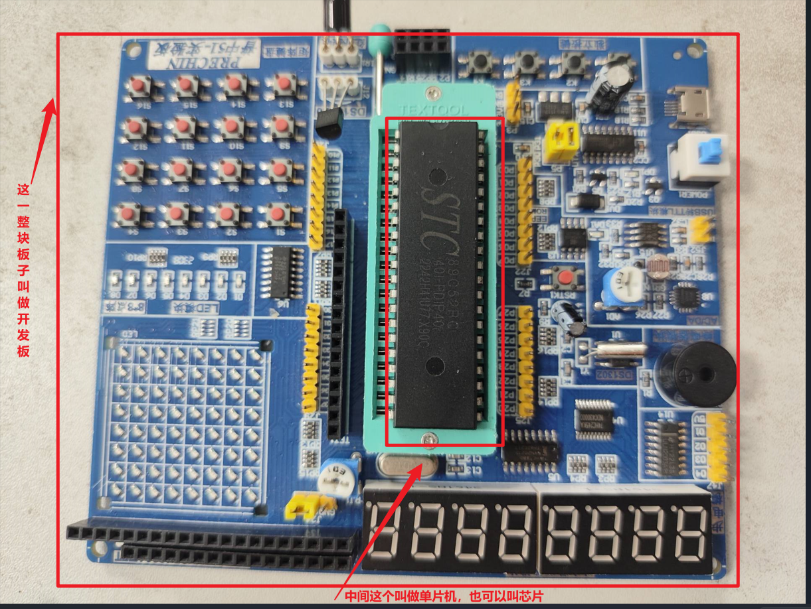
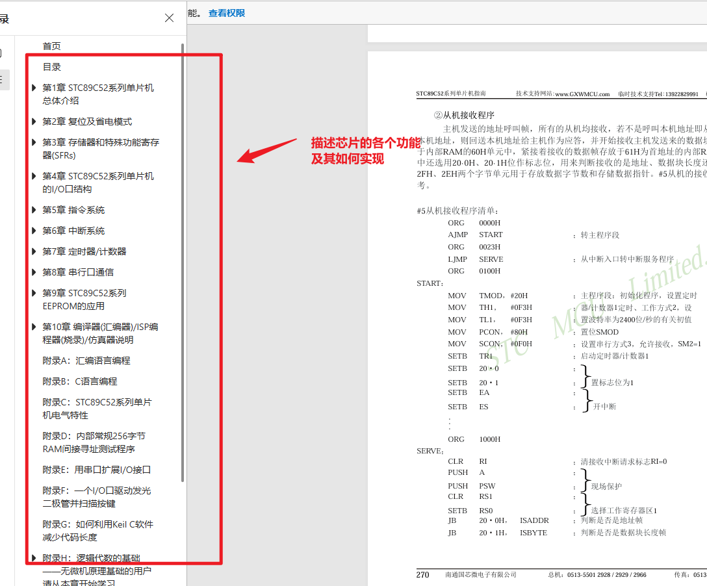
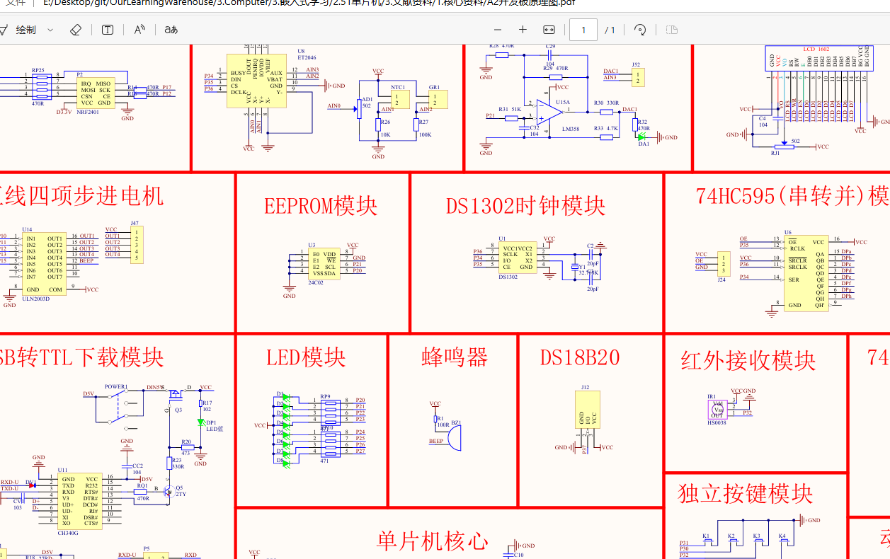
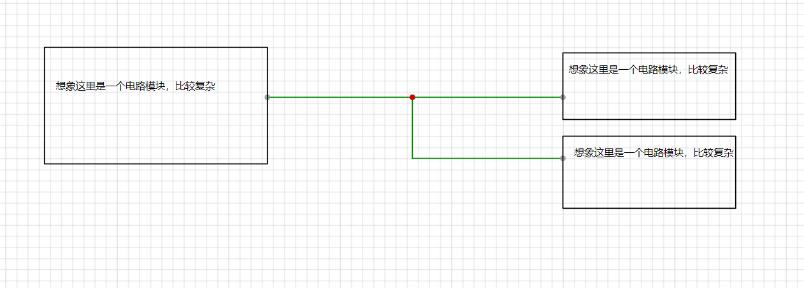
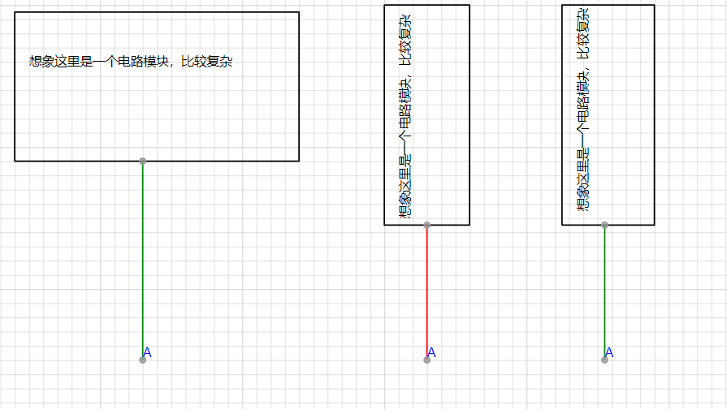
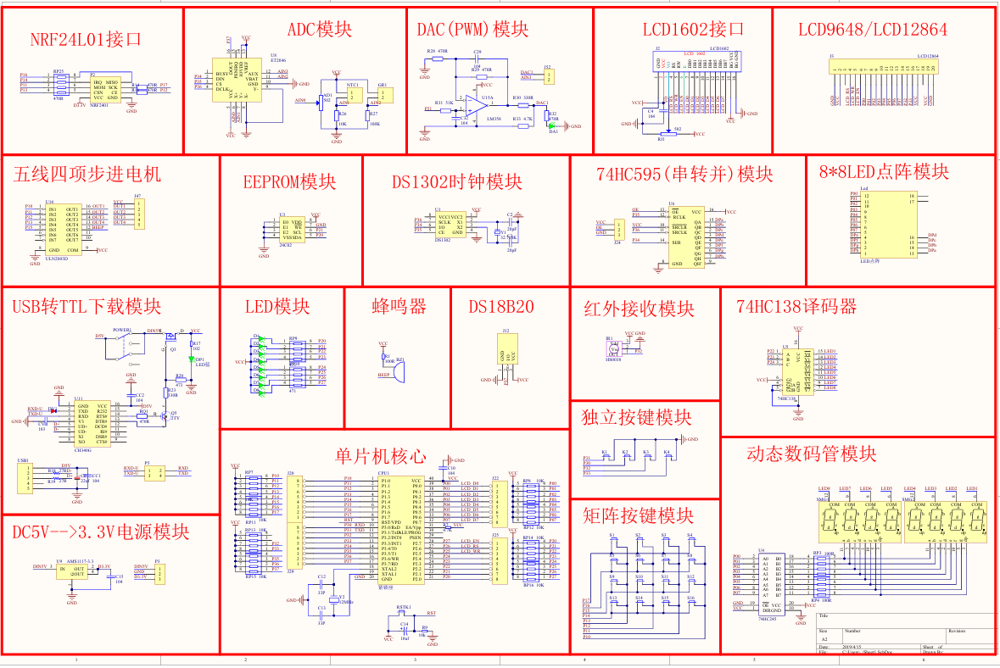
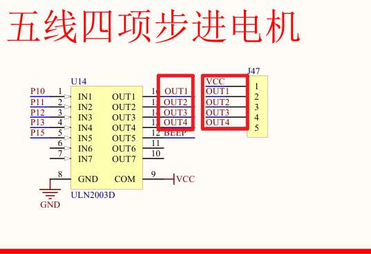
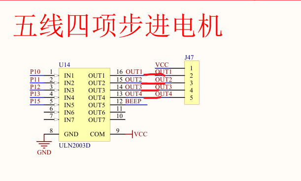

### 1.嵌入式的基本结构和名词

开发板和单片机

### 2.最核心资料及其作用

| 资料类型   | 作用                                    |
| ---------- | --------------------------------------- |
| 单片机资料 | 描述单片机的结构、功能、寄存器的知识    |
| 开发板资料 | 描述整个集成电路板（PCb）的电路连线关系 |

比如这块板子，芯片叫做STC89c52,那么我们就去找这个板子的资料，这个开发板叫A2，我们九七找A2原理图

### 3.芯片资料

### 4.开发板资料

描述了芯片和其他外设的连接关系

### 5.其他资料

比如LED如何才能亮，蜂鸣器如何实现，这些是模块资料。B站或者官方可能还有案例和教学视频，网络上也有相关博客，这些也是参考资料。

### 6.资料阅读技巧

##### 1.芯片资料

芯片资料中有很多嵌入式的概念，新手上手时，难以读懂，建议遇到不懂的概念一定要多查资料。去理解这些词汇的概念，比如什么是GPIO，什么是USART，什么是定时器，什么是中断。这些专业名词建议一个一个理解。对应英文专业名称，建议了解英文全称和中文翻译，以此减少阅读障碍（我也总结了一些）。

##### 2.原理图

原理图理解的关键就是理解什么叫**网络标签**，还要具备一些基本的电路知识，不用太深入。只要能理解欧姆定律和电路从高电压流向低电压即可。

#### 网络标签

##### 1.网络标签的思想

现在有三个电路模块，通过上面的方式连接起来，对于集成电路，一般都比较复杂，所有最好进行分开研究，于是就可以设定这样一个规则，如下图：

三个模块的线的端点只要字母一样，就代表他们连接在一起。

这样，电路就可以分开放了，这就是网络标签的思想

可以想象，如果没有使用网络标签，而是把每个线都连接起来，这个图纸会多复杂

##### 2.举例

如图，这里左边的OUT1跟右边的OUT1是连接在一起的。其他几个OUT也是一样，下面是他们实际的连接方式

